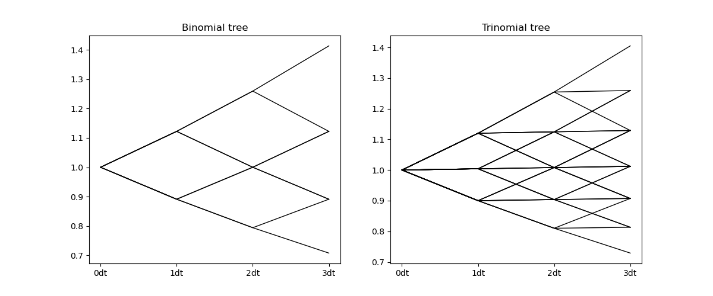

# tree_pricing-and-interest_rates
**Stanisław Majchrzak**

The project contains:
- tree pricing environment for pricing European and American options capable of calculating risk neutral measure and flexible enough to use custom up/down factors, risk nuetral measures, binomial, trinomial or even more generalized trees
  

- interest rate simulation enigine capable of running such models as Vasicek, CIR, Hull-White, Ho-Lee with both Euler-Maruyama and Milstein discretization methods; engine can calibrate some of the models to swaption dataset and visualize the results

